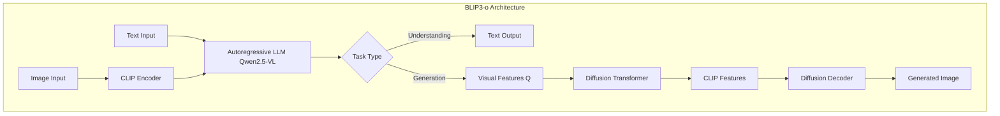
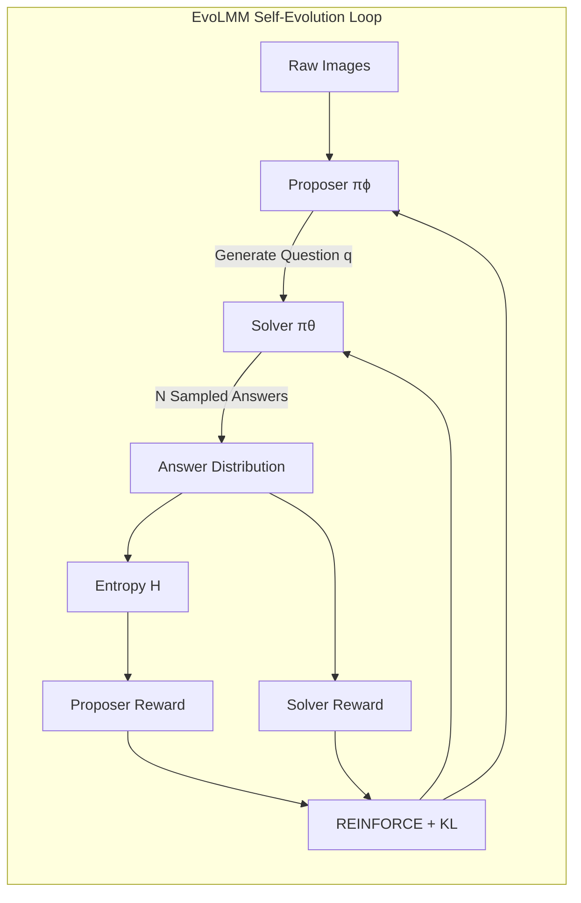
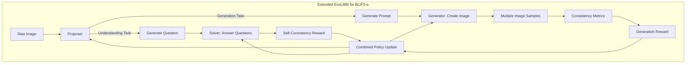
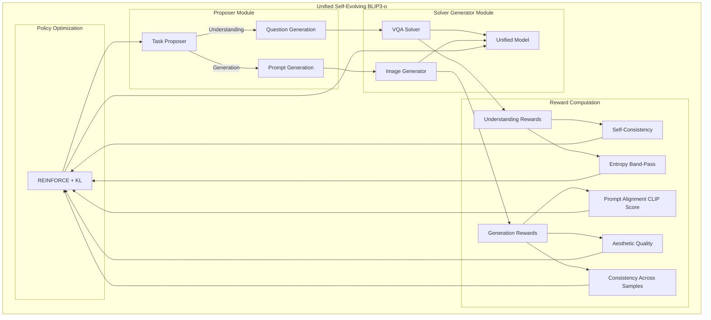

# Research Feasibility Report: Integrating EvoLMM Self-Evolving Framework with BLIP3-o Unified Model

**Date:** January 30, 2026  
**Project:** Self-Evolving Unified Understanding and Generation Model  
**Authors:** Research Team  

---

## Executive Summary

This report analyzes the feasibility of combining the **EvoLMM** fully unsupervised self-evolving framework with the **BLIP3-o** unified multimodal model for image understanding and generation. The goal is to create a self-improving unified model that can enhance both its visual reasoning and image generation capabilities without requiring human-annotated data.

> [!IMPORTANT]
> **Key Finding:** Integration is not only possible but highly synergistic. The combination leverages BLIP3-o's unified architecture with EvoLMM's self-evolution mechanism, potentially creating a model that can improve both understanding AND generation through internal feedback loops.

---

## 1. Understanding the Two Frameworks

### 1.1 BLIP3-o: Unified Multimodal Model

**Paper:** arXiv:2505.09568v1 (May 2025)  
**Core Innovation:** A unified architecture combining autoregressive LLM with diffusion model for both image understanding and generation.

#### Architecture Overview



#### Key Design Choices

| Aspect | BLIP3-o Choice | Rationale |
|--------|---------------|-----------|
| **Image Encoding** | CLIP features (64 tokens/image) | Compact, semantically rich representations |
| **Generation Objective** | Flow Matching | Better sample diversity, superior quality |
| **Training Strategy** | Sequential (Understanding → Generation) | Preserves understanding capability |
| **LLM Backbone** | Qwen2.5-VL (3B/7B) | Strong multimodal understanding |
| **Diffusion Architecture** | Lumina-Next DiT (1.4B params) | Efficient, high-quality generation |

#### BLIP3-o Codebase Structure

```
BLIP3o/
├── blip3o/
│   ├── model/
│   │   ├── blip3o_arch.py        # Core architecture (MetaModel + CausalLM)
│   │   ├── multimodal_encoder/   # CLIP vision tower
│   │   ├── multimodal_decoder/   # SANA diffusion decoder + VAE
│   │   └── language_model/       # Qwen backbone integration
│   ├── train/                    # Training utilities
│   └── data/                     # Data loading
├── trl/                          # GRPO training (RL-based alignment)
│   └── trl/trainer/grpo_trainer.py  # Custom GRPO for image generation
└── scripts/                      # Training/inference scripts
```

---

### 1.2 EvoLMM: Self-Evolving Framework

**Paper:** arXiv:2511.16672v2 (November 2025)  
**Core Innovation:** Fully unsupervised self-evolution through Proposer-Solver with continuous rewards.

#### Framework Overview



#### Key Innovations

| Component | Description | Implementation |
|-----------|-------------|----------------|
| **Continuous Solver Reward** | `r_sol = p(y_i | x,q)^γ × (1 - λ × penalty)` | Smooth gradient, avoids collapse |
| **Entropy-Based Proposer Reward** | `r_prop = exp(-(H - μ)²/2σ²)` | Encourages moderate difficulty |
| **KL-Regularized REINFORCE** | Token-level KL to reference model | Prevents catastrophic forgetting |
| **Adaptive β Controller** | Dynamically adjusts KL coefficient | Stable training dynamics |
| **LoRA Adapters** | Separate adapters for Proposer/Solver | Parameter-efficient training |

#### EvoLMM Codebase Structure

```
EvoLMM/
├── src/
│   ├── train.py                  # Main training loop (1400+ lines)
│   │   ├── Config                # All hyperparameters
│   │   ├── ImagePool             # Data loader (no labels needed)
│   │   ├── VLMCore               # Model wrapper with LoRA support
│   │   ├── VLMRole               # Thin adapter wrapper
│   │   ├── PolicyUpdater         # REINFORCE with KL + adaptive β
│   │   └── SQLM_VLM_Trainer      # Full training orchestration
│   └── train.sh                  # Example hyperparameters
├── Evaluation/                   # lmms-eval based evaluation
└── inference.py                  # Inference with LoRA checkpoints
```

---

## 2. Feasibility Analysis

### 2.1 Compatibility Assessment

#### ✅ **Highly Compatible Aspects**

| Aspect | BLIP3-o | EvoLMM | Compatibility |
|--------|---------|--------|---------------|
| **Base Model** | Qwen2.5-VL | Qwen2.5-VL | ✅ Same backbone |
| **Fine-tuning** | LoRA/GRPO | LoRA + REINFORCE | ✅ Both use LoRA |
| **Image Processing** | CLIP encoder | Any VLM processor | ✅ Compatible |
| **Training Loop** | Supervised + RL | Self-supervised RL | ✅ RL-based |

#### 🔄 **Requires Adaptation**

| Aspect | Challenge | Solution |
|--------|-----------|----------|
| **Dual Tasks** | EvoLMM focuses on understanding | Extend to generation |
| **Reward Signal** | Generation has no "correct" answer | Use internal consistency + aesthetic metrics |
| **Diffusion Integration** | EvoLMM doesn't handle diffusion | Add diffusion-aware rewards |

### 2.2 Theoretical Foundation

> [!NOTE]
> The key insight is that **self-consistency** can be applied to BOTH understanding AND generation tasks:
> - **Understanding:** Multiple answer samples → majority vote consistency
> - **Generation:** Multiple image samples → perceptual/semantic consistency

#### Self-Evolution for Unified Model



---

## 3. Integration Architecture

### 3.1 Proposed Unified Self-Evolving Architecture



### 3.2 Key Components to Develop

#### Component 1: Extended Proposer (For Both Tasks)

```python
# Pseudo-code for dual-task proposer
class DualTaskProposer:
    def __init__(self, base_model, lora_adapter):
        self.model = apply_lora(base_model, lora_adapter)
    
    def propose(self, image):
        task_type = self.sample_task_type()  # 'understanding' or 'generation'
        
        if task_type == 'understanding':
            # Generate visually grounded question
            question = self.generate_question(image)
            return {'type': 'understanding', 'question': question}
        else:
            # Generate image generation prompt based on image content
            prompt = self.generate_prompt(image)
            return {'type': 'generation', 'prompt': prompt}
```

#### Component 2: Generation Reward Functions

```python
def compute_generation_reward(generated_images, prompt):
    """
    Compute self-supervised reward for image generation.
    
    Key insight: Use INTERNAL model capabilities for reward
    without external models or human labels.
    """
    rewards = []
    
    # 1. Self-Consistency: How similar are multiple samples?
    consistency_score = compute_clip_similarity_across_samples(generated_images)
    
    # 2. Prompt Alignment: Does image match prompt?
    # Use the SAME BLIP3-o model's understanding capability
    for img in generated_images:
        caption = model.caption(img)  # Use understanding mode
        alignment = text_similarity(caption, prompt)
        rewards.append(alignment)
    
    # 3. Reconstruction Fidelity (if applicable)
    # Generate → Understand → Re-generate consistency
    
    return rewards, consistency_score
```

#### Component 3: Unified Policy Updater

```python
class UnifiedPolicyUpdater:
    def step(self, task_type, inputs, outputs, rewards):
        if task_type == 'understanding':
            # Standard EvoLMM update
            return self.understanding_update(inputs, outputs, rewards)
        else:
            # Extended for generation
            return self.generation_update(inputs, outputs, rewards)
    
    def generation_update(self, prompt, images, rewards):
        """
        Key challenge: How to backprop through diffusion?
        
        Options:
        1. REINFORCE on discrete token predictions (BLIP3o-NEXT approach)
        2. Reward-weighted loss on diffusion features
        3. Policy gradient on visual feature generation only
        """
        # Use discrete tokens for policy gradient (most practical)
        logprob = self.compute_token_logprob(prompt, predicted_tokens)
        advantage = rewards - baseline
        loss = -advantage * logprob
        return loss
```

---

## 4. Implementation Roadmap

### 4.1 Phase 1: Foundation (Weeks 1-2)

| Task | Description | Codebase |
|------|-------------|----------|
| 1.1 | Set up unified training environment | Merge dependencies |
| 1.2 | Adapt EvoLMM trainer for BLIP3-o | `train.py` → `train_unified.py` |
| 1.3 | Create dual-task data loader | No labels, mixed tasks |
| 1.4 | Implement basic understanding self-evolution | Port EvoLMM directly |

### 4.2 Phase 2: Generation Self-Evolution (Weeks 3-5)

| Task | Description | Approach |
|------|-------------|----------|
| 2.1 | Design generation Proposer | Prompt generation from images |
| 2.2 | Implement CLIP-based internal rewards | Self-supervised alignment |
| 2.3 | Add multi-sample consistency metric | Entropy over generated images |
| 2.4 | **KEY:** Discrete token policy gradient | BLIP3o-NEXT approach via GRPO |

### 4.3 Phase 3: Unified Training (Weeks 6-8)

| Task | Description | Challenge |
|------|-------------|-----------|
| 3.1 | Joint understanding + generation | Balance task sampling |
| 3.2 | Curriculum design | Start easy, increase difficulty |
| 3.3 | Multi-stage training schedule | Sequential vs joint |
| 3.4 | Ablation studies | Which components matter most |

### 4.4 Phase 4: Evaluation & Analysis (Weeks 9-10)

| Task | Benchmarks |
|------|------------|
| 4.1 | Understanding: ChartQA, MathVista, MMMU |
| 4.2 | Generation: GenEval, DPG-Bench, WISE |
| 4.3 | Joint capabilities: Image editing, visual dialogue |

---

## 5. Key Technical Challenges & Solutions

### 5.1 Challenge: Reward Signal for Generation

**Problem:** Unlike understanding tasks with discrete answers, generation has no single "correct" output.

**Solutions:**

| Approach | Description | Pros | Cons |
|----------|-------------|------|------|
| **CLIP Consistency** | Multiple samples → CLIP embedding similarity | Self-contained | May reward mode collapse |
| **Round-Trip Consistency** | Generate → Caption → Compare with prompt | Uses unified model | Computationally expensive |
| **Aesthetic Scoring** | Internal aesthetic predictor | Quality metric | Not purely self-supervised |
| **Entropy-Based** | Variance in generated samples | Novel | Unclear optimization target |

**Recommended:** Combine CLIP consistency + Round-trip verification

```python
def generation_reward(images, prompt, model):
    # 1. Cross-sample consistency (avoid collapse)
    embeddings = [get_clip_embedding(img) for img in images]
    consistency = mean_pairwise_similarity(embeddings)
    
    # 2. Round-trip alignment (self-supervised)
    captions = [model.understand(img) for img in images]  # Use BLIP3-o's understanding
    alignments = [text_similarity(cap, prompt) for cap in captions]
    
    # 3. Band-pass reward (like EvoLMM proposer)
    # Reward moderate difficulty, not trivial prompts
    entropy = caption_entropy(captions)
    band_pass = gaussian_reward(entropy, mu=0.7, sigma=0.3)
    
    return alignments * band_pass, consistency
```

### 5.2 Challenge: Backpropagation Through Diffusion

**Problem:** Diffusion models are not directly differentiable for RL.

**Solutions:**

| Approach | Description | BLIP3-o Applicability |
|----------|-------------|----------------------|
| **DDPO/DPOK** | Direct diffusion policy optimization | Requires denoising differentiability |
| **Discrete Tokens** | RL on token predictions only | ✅ BLIP3o-NEXT already does this |
| **Reward-Weighted MSE** | Weight flow matching loss by reward | ✅ Compatible with existing training |
| **GRPO** | Group relative policy optimization | ✅ Already implemented in codebase |

**Recommended:** Use **BLIP3o-NEXT approach** (discrete tokens + GRPO)

The BLIP3o codebase already includes GRPO training for generation:

```python
# From BLIP3o/trl/train_grpo.py
trainer = GRPOTrainer(
    model="BLIP3o-NEXT-SFT",
    reward_funcs=custom_reward,  # Can be self-supervised!
    args=training_args,
    train_dataset=train_dataset,
)
```

### 5.3 Challenge: Task Balancing

**Problem:** Understanding and generation may require different training dynamics.

**Solution:** Adaptive task sampling based on reward progress

```python
class AdaptiveTaskSampler:
    def __init__(self):
        self.understanding_baseline = 0.0
        self.generation_baseline = 0.0
        self.momentum = 0.9
    
    def sample_task(self):
        # Prioritize the task with more room for improvement
        under_gap = 1.0 - self.understanding_baseline
        gen_gap = 1.0 - self.generation_baseline
        
        prob_understanding = under_gap / (under_gap + gen_gap + 1e-8)
        return 'understanding' if random.random() < prob_understanding else 'generation'
    
    def update(self, task, reward):
        if task == 'understanding':
            self.understanding_baseline = self.momentum * self.understanding_baseline + (1-self.momentum) * reward
        else:
            self.generation_baseline = self.momentum * self.generation_baseline + (1-self.momentum) * reward
```

---

## 6. Expected Outcomes & Metrics

### 6.1 Quantitative Targets

| Benchmark | Baseline (BLIP3-o) | With EvoLMM | Target Gain |
|-----------|-------------------|-------------|-------------|
| ChartQA | 86.7% | 89%+ | +2-3% |
| MathVista | 70.5% | 73%+ | +2-3% |
| GenEval | 0.84 | 0.87+ | +0.03 |
| WISE | 0.62 | 0.65+ | +0.03 |

### 6.2 Qualitative Outcomes

1. **Emergent Curriculum:** Model generates progressively harder questions/prompts
2. **Cross-Task Benefits:** Understanding improvements help generation (and vice versa)
3. **No Human Labels:** All training from raw images only
4. **Scalable:** Framework applicable to larger models

---

## 7. Experimental Design

### 7.1 Ablation Studies

| Experiment | Question |
|------------|----------|
| Understanding only | Does EvoLMM improve BLIP3-o understanding? |
| Generation only | Can generation self-improve? |
| Joint training | Is there synergy? |
| Reward ablation | Which reward components matter? |
| Task ratio | What's the optimal understanding:generation ratio? |

### 7.2 Training Configurations

```yaml
# Recommended starting configuration
base_model: "BLIP3o-8B"
training:
  total_steps: 16000
  batch_size: 1  # Per-task
  num_samples: 5  # For consistency
  
lora:
  rank: 16
  alpha: 32
  dropout: 0.05
  targets: ["q_proj", "k_proj", "v_proj", "o_proj", "mm_projector"]
  
rewards:
  understanding:
    solver_gamma: 0.7
    proposer_entropy_mu: 0.9
    proposer_entropy_sigma: 0.35
  generation:
    clip_consistency_weight: 0.5
    roundtrip_weight: 0.5
    entropy_band_mu: 0.7
    entropy_band_sigma: 0.3
    
kl:
  target: 0.02
  adapt_rate: 0.1
  initial_coef: 0.001
  
task_sampling:
  initial_ratio: 0.7  # 70% understanding, 30% generation
  adaptive: true
```

---

## 8. Risks & Mitigations

| Risk | Likelihood | Impact | Mitigation |
|------|------------|--------|------------|
| **Mode Collapse (Generation)** | Medium | High | Diversity regularization, entropy rewards |
| **Catastrophic Forgetting** | Low | High | KL regularization, separate adapters |
| **Training Instability** | Medium | Medium | Adaptive KL, reward normalization |
| **Reward Hacking** | Medium | Medium | Multiple reward signals, round-trip verification |
| **Compute Cost** | High | Medium | Start small, progressive scaling |

---

## 9. Conclusion & Recommendations

### 9.1 Feasibility Verdict

> [!TIP]
> **VERDICT: HIGHLY FEASIBLE** with careful implementation

The integration is feasible because:

1. ✅ **Same backbone:** Both use Qwen2.5-VL
2. ✅ **Compatible training:** Both use LoRA + RL
3. ✅ **Existing components:** GRPO for generation already in BLIP3-o codebase
4. ✅ **Theoretical grounding:** Self-consistency applies to both tasks

### 9.2 Recommended Next Steps

1. **Immediate (Week 1):**
   - Set up merged codebase
   - Run EvoLMM on BLIP3-o backbone (understanding only)
   - Verify baseline performance

2. **Short-term (Weeks 2-4):**
   - Implement generation reward functions
   - Prototype joint training loop
   - Initial experiments on small scale

3. **Medium-term (Weeks 5-8):**
   - Full-scale training experiments
   - Ablation studies
   - Hyperparameter optimization

4. **Long-term (Weeks 9+):**
   - Comprehensive evaluation
   - Paper writing
   - Open-source release

### 9.3 Required Resources

| Resource | Minimum | Recommended |
|----------|---------|-------------|
| **GPUs** | 4× A100 (40GB) | 8× A100 (80GB) |
| **Training Time** | ~2 weeks | ~4 weeks (with ablations) |
| **Data** | Raw images only | 10K-100K images |

---

## Appendix A: Code Integration Points

### A.1 Files to Modify/Create

| File | Purpose | Base |
|------|---------|------|
| `train_unified.py` | Main training loop | EvoLMM `train.py` |
| `rewards/generation.py` | Generation rewards | New |
| `rewards/combined.py` | Unified reward logic | New |
| `model/unified_core.py` | BLIP3-o + LoRA wrapper | BLIP3-o + EvoLMM |
| `data/dual_task_loader.py` | Image loader with task sampling | EvoLMM `ImagePool` |

### A.2 Key Functions to Implement

```python
# Core functions needed
def compute_generation_reward(images, prompt, model) -> List[float]
def compute_roundtrip_consistency(image, model) -> float
def dual_task_step(trainer, image, task_type) -> Dict
def adaptive_task_sample(baselines) -> str
def generation_policy_gradient(tokens, rewards, logprobs) -> torch.Tensor
```

---

## Appendix B: References

1. **BLIP3-o:** Chen et al., "BLIP3-o: A Family of Fully Open Unified Multimodal Models", arXiv:2505.09568
2. **EvoLMM:** Thawakar et al., "EvoLMM: Self-Evolving Large Multimodal Models with Continuous Rewards", arXiv:2511.16672
3. **GRPO:** Shao et al., "DeepSeekMath: Pushing the Limits of Mathematical Reasoning", 2024
4. **DDPO:** Black et al., "Training Diffusion Models with Reinforcement Learning", ICLR 2024
5. **Self-Play:** Silver et al., "Mastering the game of Go with deep neural networks and tree search", Nature 2016

---

*Report generated for research planning purposes. Implementation details subject to refinement during experimentation.*
